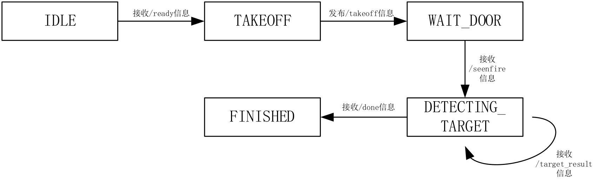
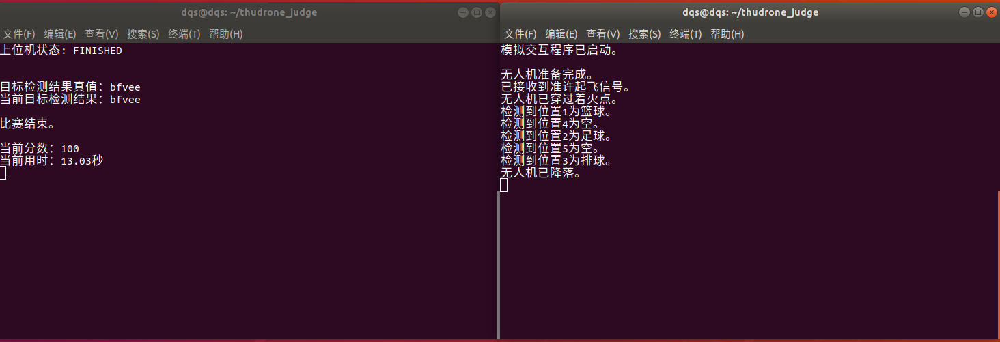

# 上位机模拟程序和无人机与上位机交互例程

## 选手通信协议

这是比赛选手本地可以运行的上位机模拟器，主要有以下功能：

- 读取`/ready` 话题的消息 
  - 上位机起始状态为IDLE
  - 话题的内容是0或者1，1表示无人机准备完毕，请求起飞
- 收到请求信号后，向`/takeoff`话题发送起飞准许
  - 收到请求信号后上位机状态变为TAKEOFF，发送起飞准许命令后状态变为WAIT_DOOR
  - score+=30，并开始计时
- 读取`/seenfire` 话题的消息
  - 内容是0或者1 ，1表示无人机已经成功穿过着火点
  - score+=30，开始接收、处理无人机发布的目标检测结果
- 读取`/target_result` 话题的消息，以获得无人机发布的目标检测结果，并更新该部分对应得分（满分30分）
  - 话题的内容是长度为 2 的字符串。字符串的前一位取值为'1'、'2'、'3'、'4'、'5'之一，表示目标所在位置;后一位取值为'e' 、'b'、'f' 、'v'之一，分别
表示对应位置为空、为篮球、为足球、为排球。如"1b"表示第 1 个位置为篮球。
  - 每个位置以该位置第一次收到的结果为准，后续该位置收到的目标检测结果会被忽略。
  - **注意：** 若某个位置为空，无人机也应当发布消息表明对应位置的检测结果为空，否则无法获得该位置的分数。
- 读取`/done`话题,收到1表示无人机成功完成任务，已经降落，score+=10，结束计时。

上位机FSM状态转移图如下：




## 文件组织

该项目中有两个文件，judge.py 和 control.py

其中 judge.py 为本地的上位机模拟器。control.py 为整体与上位机交互流程。同学们可以参考 control.py 的写法在自己的程序中添加上位机交互代码。

## judge.py

在启动roscore后，新建终端，直接运行 

```Shell
    python judge.py
```

即可在本地新建一个上位机裁判逻辑终端。可以通过修改 judge.py 第27行的target_groundtruth_来变更待检测目标的ground truth。

target_groundtruth_是一个长度为5的字符串。字符串每一位的取值为'e' 、'b'、'f' 、'v'之一，表示对应位置上的目标类型。

judge.py还包含一系列可用的ROS服务，用于上位机图形化界面的开发。它们的列表如下：

- `/get_detected_target` ：获取当前无人机目标识别的结果，返回值是一个长度为5的字符串。
- `/get_ground_truth` ：获取目标识别结果的ground truth，（即target_groundtruth），返回值是一个长度为5的字符串。
- `/get_score` ：获取当前比赛得分。
- `/get_state` ：获取当前上位机状态，返回结果为字符串（如"IDLE"）。
- `/get_time` ：获取当前比赛时间。
- `/reset` ：用于重置上位机状态。
- `/set_ground_truth` ：用于设置目标识别结果的ground truth。

严禁比赛选手与上述服务交互，一经发现，以作弊论处。

## control.py

control.py 是一个范例程序，模拟了无人机与上位机的交互流程。

在启动judge.py后，新建终端，运行

```Shell
    python control.py
```

即可观察到模拟的交互过程。

其中27到88行（test_control函数）为主要的交互部分。

## 使用

在运行roscore后，先在终端A（左侧）运行 judge.py。再在终端B（右侧）运行 control.py。 
可以看到control.py与judge.py 的交互过程。

运行结果如下图


